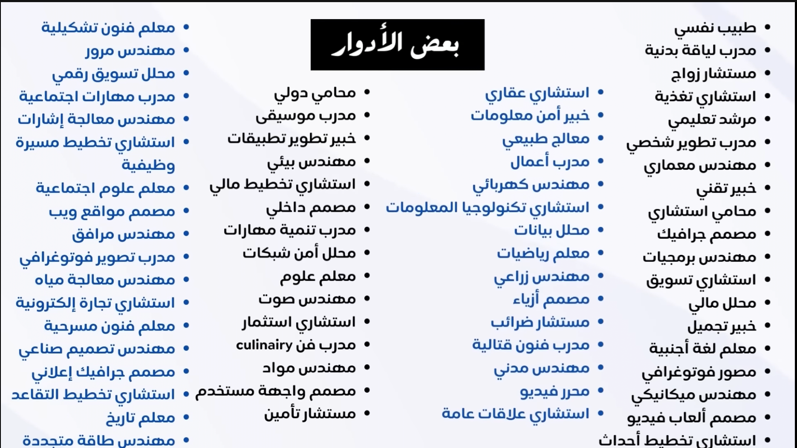
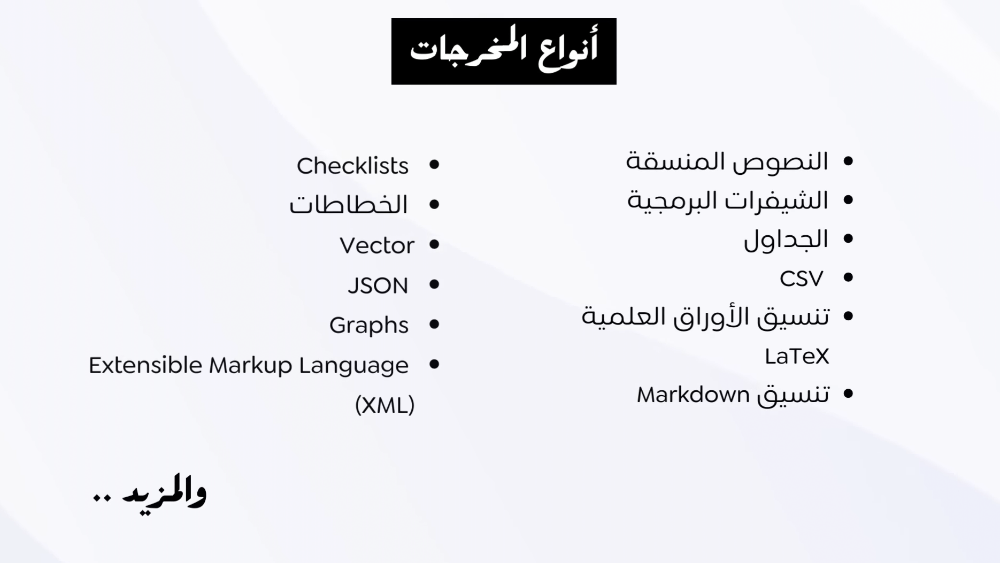
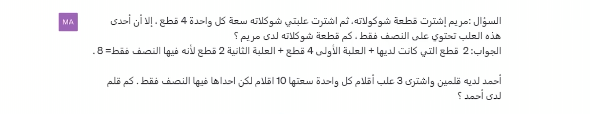

# Prompt Enginering

[Important documentation Link](https://www.promptingguide.ai/introduction/basics)

### What is LLM's 

> ``` LLLM's ``` is for Large Language Model like Chat GPT , Gemini , Claude etc <br> The LLM's is consider as AGI [Artficial Global Intelginte] the AI is sorted as [ANI , AGI , ASI] <br> LLM's هي خوارزمية تعلم آلي خاضعة للاشراف هدفها تحليل الانحدار او ال regression لمجموعة من البيانات باستخدام طريقة <br> الطريقة دي بتتسمي Ensemble Learning 

> Ensemble Learning : هي خوارزمية بتجمع بين طرق خوارزميات التعلم المختلفة بحيث تدعم كل خوارزمية الثانية في سبيل تقوية التنبؤ


> الخوارزميات دي بتكون احصائية واتطورت جدا دلؤتي بسبب طرق جمع البيانات اللي عرفنا نحصرها وخصوصا بطريقة اسمها<br> whisper واللي بتقدر انها تعمل تفريغ للبيانات من الصوت والفيديو والملفات والتعليم بيستخدم الشبكات العصبية  كخوارزمية واللي بتقدر تربط بين الكلمات والدلالات المهمة وكل الحجات اللي بيتعلمها او المدخلات بتتسمي parameters


### What LLM's Can Do:

<ul> 

<li> الترتيب
</li>

<li> الفلترة
</li>

<li> الاستنباط وهذا مهم جدا
</li>

</ul>


### Context - السياق

> من اهم الحجات اللي بتخليك تطلع نتائج كويسة انط تضيف السياق مثال

> لو انا حد جديد في بايثون حقؤل الامر التالي : انا مبتداء في بايثون اعطيني تمارين خاصة للمساعدة علي زيادة مهاراتي <br> الاجابة حتكون مش كويسة وبتضيع الحل :

> انا اتعلم لغة بايثون حديثا ولدي مشكلة في الحلقات التكرارية اريد منك ان تقوم بمساعدتي بتمارين وشرح طرق تشغيلها مع امثلة <br> المشكلة : الحلقات التكرارية بلغة بايثون وكيفية عملها <br> المراد : قم بعمل بعمل شرح مبسط مع فكرة بسيطة لكل مثال ثم قم بعمل تمارين تساعدني علي فهمها جيدا


### Roles - الادوار

> لو عاوز اقؤل للذكاء الاصطناعي ايه هو البحر فا حيشرحها بطريقة مش بالدور اللي عاوزه 

> الحل : انت بروفيسور في الادب العربي , ما هو البحر . <br> النتيجة ساعتها حتكون اللي انا عاوزه بالظبط لاني دحلته في الدور اللي عاوز النتيجة تطلع منه ودي بعض الادوار المهمة وممكن نزود احنا كمان :)



### Output Indicator - مؤشر المخرجات

> تحديد المخرجات هي حاجة مهمة جدا وبتطلع النتائج المحددة اللي بكون عاوزها

> المثال التالي حيكون بنستخدم فيه كل الحجات اللي اتعلمناها <br> انت بروفيسور جامعي في البرمجة وعندك آلاف الطلبة ,انا طالب مبتدئ يقوم بتعلم البرمجة ذاتيا اريد منك ان تقوم بعرض لي لغات برمجة من الاسهل الي الاصعب ووقت تعلمها بالاسابيع والمخرجات تكون في شكل جدول 

> تستطيع عمل المخرجات كما تشاء جدول csv ...

> اهم المخرجات التي يجب معرفتها :

<ul> 

<li> JSON
</li>

<li> CSV
</li>

<li> Table
</li>

<li> SVG
</li>

<li> المخططات الشجرية
</li>

<li> Multilevel Diagram (tree)
</li>

</ul>




### Input Data - مدخلات البيانات

> يفضل اضافة البيانات في اخر الكلام ويجب وضع المعلومات بين علامات التنصيص ``` " " ```


## تقنيات التلقين

> تقنيات التلقين هي شئ مهم جدا في مجال ال prompt enginering 

### Zero-Shot Prompting

> هو كتابة تلقين مباشر وعام بدون سياق ولا مثال والنموذج سيكون قادر علي تزويدك باجابات لم يتم تدريبه بالضرورة علي الاجابة عليها بشكل مباشر مثال:

> ما هي عاصمة فرنسا , لخص النص التالي ... , ترجم الجملة التالية


### Few-Shot Prompting (one-shot prompting)

> تستخدم التقنية دي كمان في تلقين النماذج لتعليمها مثال عليها :

> س:المغرب <br> ج:الرباط <br> س:السودان <br> ج:

> سيقوم بتخمين والاجابة الخرطوم


> ايه المهم في التقنية دي ؟ نقدر من خلال التقنية دي ان احنا نعلم الذكاء الاصطناعي شئ جديد ومن خلاله نقدر نعيد استخدامه زي المثال التالي 

> حدي الذكاء الاصطناعي كلمة مش موجودة في اللغة العربية زي الجملة التالية "كان جمال يتجمودر عن الريح في سيارته وكانت جمودرا منيعا" دلؤتي حخلي الذكاء الاصطناعي يعملي جمل جديدة بتشيل المعني ده وحيقدر يفهم السياق ويطلع جمل بتشيل المعني المراد اخراجة لها


### Chain-of-Thought Prompting (COT)

> هي طريقة بتخلي الذكاء الاصطناعي لو مقدرش انه يحل مسئلة معينة لان طريقة تفكيره مجبتهاش هي اني ابدء اديهاله بالتسلسل عن طريق اني ابدء اديله في الاول مسئلة شبيهة سهلة الحل واجابتها وبعد كده ابدء اني اعرض عليه المسئلة الثانية او المراد حلها وكده اكون قدرت اني ادرج افكاره 



> الفرق بين ال Few-shot وال COT هي ان ال COT لازم يكون فيه تسلسل افكار زي ما معروض في الصورة للحل عشان يبدء ان هو يحلل الحل بيمشي ازاي مش  مجرد بديله الاجابة وخلاص


### Self-Consistency Prompting


